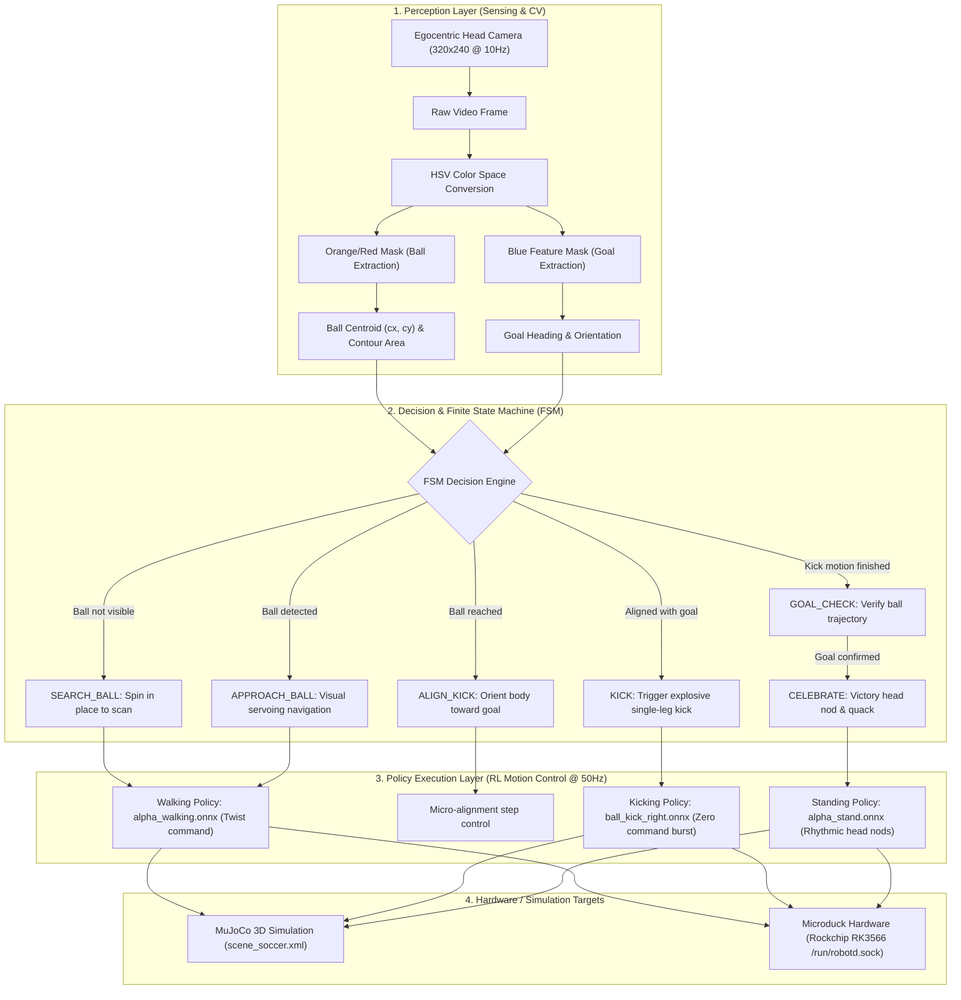

# 🦆 Microduck Soccer: Autonomous CV Bipedal Soccer Robot ⚽

<p align="center">
  <a href="README.md"><b>English</b></a> | <a href="README_zh.md"><b>中文</b></a>
</p>

<p align="center">
  
  
  
  
  
  
</p>

<p align="center">
  <em>The first end-to-end <b>autonomous computer vision soccer system</b> for Pollen Robotics' <b>Microduck</b> bipedal robot.</em><br>
  <em>Features autonomous ball tracking, visual servoing, goal alignment, dynamic single-leg kicking, and goal celebration in both <b>MuJoCo 3D simulation</b> and <b>real-world standalone onboard execution</b> (Rockchip RK3566)!</em>
</p>

---

## 📖 Overview

**Microduck** is a compact 25 cm, ~800 g, 15-DOF bipedal robot developed by Pollen Robotics (Hugging Face). While baseline walking and kicking reinforcement learning policies have been trained, the official roadmap lists full autonomous ball play as an unbuilt idea.

This project delivers the complete, self-contained **autonomous soccer brain** for Microduck:
1. **👁️ Egocentric Vision (OpenCV)**: Uses only the robot's front-facing head camera without external motion capture or global cameras. Detects the ball and goal at 10Hz+.
2. **🏃 Deep RL Locomotion**: Uses the official `alpha_walking.onnx` policy driven by visual servoing to steer and navigate smoothly toward the ball.
3. **🎯 Goal Alignment & Ball Positioning**: Centers the goal in view and positions the ball in the sweet spot for the kicking foot.
4. **⚡ Dynamic Single-Leg Kicking (Deep RL)**: Switches to `ball_kick_right.onnx`, dynamically balances on the left leg, draws the right leg back, and swings with an explosive kick!
5. **🎉 Goal Line Detection & Celebration**: Detects when the ball crosses into the net, triggers a celebratory HUD banner, and makes the duck nod proudly!
6. **🤖 Standalone Real Robot Onboard Deployment**: Ships with `duck_soccer_onboard.py`, communicating via Unix Socket (`/run/robotd.sock`) over JSON-RPC 2.0 directly on the onboard Rockchip RK3566 board—no external laptop needed!

---

## 🏗️ System Architecture



---

## 🎯 State Machine Lifecycle (FSM)

| State | Trigger Condition | Behavior | Transition Out |
| :--- | :--- | :--- | :--- |
| **`SEARCH_BALL`** | Ball not found in camera view | Rotate slowly in place (`vtheta = 0.45 rad/s`) with head pitched down | Valid ball contour detected (`area > 15`) |
| **`APPROACH_BALL`** | Ball centroid `(cx, cy)` locked | Compute heading error `err_x = 160 - cx`, visual servo steer with `vx = 0.35 m/s` forward | Reached ball (`dist < 0.22m` or `area > 1800`) |
| **`ALIGN_KICK`** | Ball in close proximity | Measure duck-to-goal angle, align heading directly with goal center, position ball in front of right foot | Heading error `\|yaw_diff\| < 10°` |
| **`KICK`** | Alignment complete | Swap policy to `ball_kick_right.onnx`, balance on left foot, sweep right foot back and kick forward (~2.7s) | Kick cycle timer expires |
| **`GOAL_CHECK`** | Kick complete | Track ball velocity and position relative to goal posts | Ball settles or crosses goal line |
| **`CELEBRATE`** | Ball crosses line (`x >= 2.75m, \|y\| < 0.4m`) | Display golden GOOOOAL overlay, switch to standing policy and nod head rhythmically | Timer expires, resets to search |

---

## 🚀 Simulation Quickstart (MuJoCo)

### 1. Requirements & Setup
Ensure you have Python 3.10+ installed, then install dependencies:

```bash
pip install -r requirements.txt
```

### 2. Run the 3D Soccer Simulation
Execute the main simulation script:

```bash
python sim_duck_soccer.py
```

### 3. Interactive Views
When launched, two windows will open:
1. **MuJoCo 3D Viewer**:
   - Free camera view showing the duck walking on the pitch, balancing on one foot, and kicking the ball into the goal net.
   - Mouse controls: Right-click drag to rotate, middle-scroll to zoom, left-click drag to pan.
2. **OpenCV Egocentric HUD View**:
   - First-person view directly from the duck's head camera.
   - Overlays real-time bounding boxes (orange for ball, blue for goal), targeting crosshairs, state name, distance, and telemetry data.

---

## 🤖 Real Robot Standalone Deployment

Microduck contains an onboard **Rockchip RK3566 (Quad-Core 64-bit ARM Cortex-A55 Linux)** computer. The included script [`duck_soccer_onboard.py`](duck_soccer_onboard.py) runs **entirely onboard without needing any external PC or Wi-Fi connection**!

### 1. How It Works
- **Vision**: Reads onboard head camera stream `/dev/video0` directly with OpenCV.
- **Communication**: Interacts with the local daemon `/run/robotd.sock` using standard JSON-RPC 2.0:
  - Walk: `{"method": "robot.move", "params": {"vx": 0.35, "vy": 0.0, "vtheta": ...}}`
  - Kick: `{"method": "robot.do", "params": {"skill": "kick_right"}}`
  - Sound: `{"method": "robot.sound", "params": {"tag": "happy"}}`

### 2. Step-by-Step Setup

#### Step 1: Copy script to the duck
Connect your laptop to the duck's Wi-Fi network and transfer the script:
```bash
scp duck_soccer_onboard.py radxa@<DUCK_IP>:~/
```

#### Step 2: Test run on the robot
```bash
ssh radxa@<DUCK_IP>
python3 duck_soccer_onboard.py
```

#### Step 3: Autostart on boot (True standalone autonomy)
Create a systemd service file on the duck:
```bash
sudo systemctl edit --force --full duck-soccer.service
```
Paste the following configuration:
```ini
[Unit]
Description=Microduck Autonomous Soccer Onboard System
After=robotd.service
Wants=robotd.service

[Service]
Type=simple
User=radxa
WorkingDirectory=/home/radxa
ExecStart=/usr/bin/python3 /home/radxa/duck_soccer_onboard.py
Restart=on-failure
RestartSec=3

[Install]
WantedBy=multi-user.target
```
Enable the service:
```bash
sudo systemctl enable --now duck-soccer.service
```
Now disconnect all cables, turn on the battery, place the duck on the floor with a mini soccer ball, and watch it play soccer completely autonomously!

### 3. Hardware Best Practices
1. **Ball Selection**: Use a 70 mm, 15–30 g **hollow floorball, plastic ball, or foam mini soccer ball**. Do not use heavy full-size soccer balls to protect the servo gears.
2. **Braking Buffer**: Due to real-world floor friction, the onboard script pauses (`robot.stop()`) for 0.6 s before triggering `kick_right` to eliminate momentum and ensure solid footing.
3. **Lighting**: In dimly lit rooms, adjust the HSV thresholds in `duck_soccer_onboard.py` for optimal detection.

---

## 📂 Repository Structure

```text
microduck/
├── sim_duck_soccer.py        # ⚽ MuJoCo simulation & CV visual servoing loop
├── duck_soccer_onboard.py    # 🤖 Standalone real-robot onboard script
├── requirements.txt          # 📦 Python dependencies
├── README.md                 # 📖 English documentation
├── README_zh.md              # 📖 Chinese documentation
│
├── microduck_rl/             # 🏟️ MuJoCo robot and pitch assets
│   └── src/mjlab_microduck/robot/microduck/
│       ├── scene_soccer.xml  # ⚽ Pitch, goal posts, net, and ball configuration
│       ├── robot_allcollisions.xml # Duck 15-DOF kinematic collision definition
│       └── assets/           # 3D meshes (STL) and textures
│
└── microduck/                # 🧠 Trained reinforcement learning policies
    └── policies/
        ├── alpha_walking.onnx    # Official PPO walking policy (61D -> 14D)
        ├── ball_kick_right.onnx  # Official PPO right-foot kick policy (61D -> 14D)
        ├── ball_kick_left.onnx   # Official PPO left-foot kick policy (61D -> 14D)
        └── alpha_stand.onnx      # Official PPO standing balance policy (61D -> 14D)
```

---

## 🗺️ Roadmap

- [x] Front-facing camera ball detection and tracking
- [x] Visual servoing locomotion towards ball
- [x] Goal alignment and stance adjustment
- [x] Dynamic RL kicking execution
- [x] Standalone real-robot onboard execution script (Rockchip RK3566)
- [ ] **Goalie Duck Mode**: Implement a goalkeeper duck using vision to dive and save shots.
- [ ] **2v2 Team Matches**: Enable multi-duck coordination and cooperative passing.
- [ ] **RKNN NPU Acceleration**: Convert the CV pipeline to run on the onboard Rockchip NPU at 60 FPS.

---

## 🤝 Acknowledgments

- **[Pollen Robotics](https://pollen-robotics.com)** & **[Hugging Face](https://huggingface.co)** for creating and open-sourcing the Microduck platform and training policies.
- **[DeepMind MuJoCo](https://mujoco.org/)** for the physics simulation engine.
