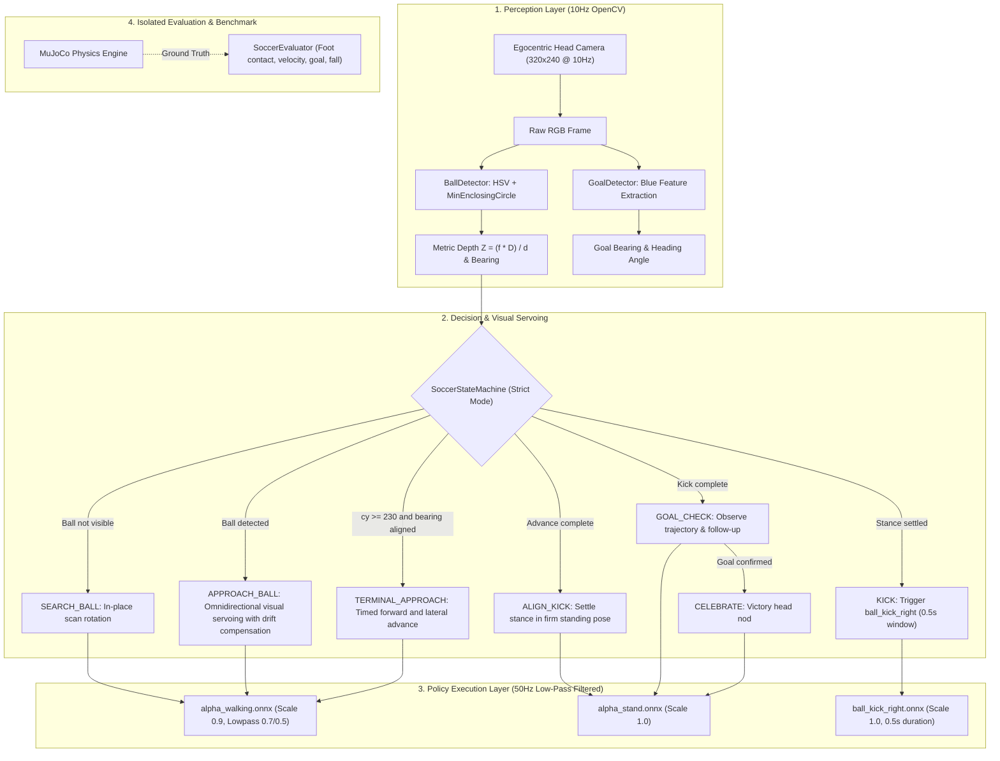

# 🦆 Microduck Vision Soccer: Closed-Loop Visual Servoing & Bipedal Kick System ⚽

<p align="center">
  <a href="README.md"><b>English</b></a> | <a href="README_zh.md"><b>中文文档</b></a>
</p>

<p align="center">
  
  
  
  
  
  
</p>

<p align="center">
  <em>A simulator-first visual servoing layer for <b>Pollen Robotics Microduck</b> that closes the perception-action loop around the official ball-blind <code>BallKick</code> policy.</em><br>
  <em>Features strict vision-only navigation (no ground-truth state cheats), monocular metric depth estimation, physical bipedal kicking (no ball teleportation), and an automated benchmark suite.</em>
</p>

> **Status: simulation prototype.** Distance-based slowdown, physical kick-contact metrics and a shared onboard state machine are implemented. In strict vision mode, the final blind advance is still time-calibrated; goal bearing is observed but is not used to aim. A separate ground-truth navigation baseline is now available below. Hardware operation is unverified. See [VALIDATION.md](VALIDATION.md) for tests and limitations.


---

## 📖 Motivation & Technical Positioning

In the official [Pollen Robotics Microduck](https://github.com/pollen-robotics/microduck) reinforcement learning stack, the pre-trained `ball_kick_right.onnx` policy is intentionally **ball-blind**: it executes a dynamic kicking motion from a standing stance, assuming an operator or high-level behavior has already navigated the robot to the ball. Furthermore, official architecture documents designate ball play (`approach / line up / kick`) as a planned perception-driven autonomous behavior.

While projects like `quackd` (2D simulator) and recent community edge implementations (e.g. RDK X5) explore ball tracking, **Microduck Soccer** provides a clean, simulator-first, strict visual servoing layer designed directly against the official Microduck MJCF models, sensor conventions, and `robotd` runtime:

- **100% Strict Vision (`--mode strict`)**: The controller relies strictly on RGB head camera frames and robot proprioception (IMU, joint encoders). Ball world position and velocity are reserved for evaluation; joint velocity and IMU observations still feed the low-level policy.
- **Physical Dynamic Kick (No Teleportation)**: Attempts to navigate into the right-foot strike zone. No artificial ball teleportation or snapping.
- **Monocular Metric Depth Estimation**: Solves metric distance from known ball diameter ($D = 70\text{ mm}$) using pinhole geometry:
  $$Z \approx \frac{f \cdot D}{d}$$
- **Official `robotd` Control Chain Alignment**: Implements official action scaling ($0.9$ walk, $1.0$ kick/stand), first-order joint low-pass filters (legs $\alpha=0.7$, head $\alpha=0.5$), and official 0.5s kick duration windows.
- **Onboard RPC Protocol Compliance**: Real-robot script (`duck_soccer_onboard.py`) uses the `duck-ipc-proto` request shape (hardware unverified): continuous `robot.move` notifications with `vyaw` (not `vtheta`), discrete `robot.do` requests, and official `chirp` voice tags.

---

## 🏗️ System Architecture



---

## 🎯 State Machine Specification

Because the forward-facing egocentric camera cannot see objects directly beneath the beak ($Z \le 0.35\text{ m}$), the controller solves the terminal camera blind spot through a visual approach followed by a calibrated timed advance; the blind-zone boundary depends on head pose:

| State | Perception Trigger | Control Action | Transition Condition |
| :--- | :--- | :--- | :--- |
| **`SEARCH_BALL`** | `ball.visible == False` | In-place yaw spin ($v_{\text{yaw}} = 0.40\text{ rad/s}$) | `ball.visible == True` |
| **`APPROACH_BALL`** | Ball bearing $\theta$ and depth $Z$ | Visual servoing steering ($v_{\text{yaw}} = -2.0 \theta$), distance-dependent advance ($v_x = 0.30\ldots0.35$; stop advancing for large bearing error), and lateral drift compensation ($v_y$) | Ball touches bottom of frame ($c_y \ge 230$) |
| **`TERMINAL_APPROACH`** | Ball enters beak blind spot | Timed advance ($v_x=0.35$, $v_y=0.06$, $t=1.52$); commanded speed is not measured displacement | Timer expires ($t \ge 1.52\text{ s}$) |
| **`ALIGN_KICK`** | Terminal timer complete; ball position unconfirmed | Stand firmly in `alpha_stand` to eliminate forward inertia | Stance settled ($t \ge 0.30\text{ s}$) |
| **`KICK`** | Settling timer complete | Swap ONNX policy to `ball_kick_right.onnx` for dynamic single-leg strike | Kick duration expires ($0.5\text{ s}$) |
| **`GOAL_CHECK`** | Kick finished | Stand upright and observe ball trajectory | Strict mode returns to `SEARCH_BALL` after waiting; goal truth is evaluation-only |
| **`CELEBRATE`** | Demo-only evaluator goal signal | Pitch head up and down rhythmically, victory celebration | Timer expires |

---

## 🚀 Simulation Quickstart

### 1. Installation
```bash
git clone https://github.com/toyhank/microduck.git
cd microduck
pip install -r requirements.txt
```

### 2. Run the 3D Soccer Simulation (Strict Vision Mode)
```bash
# Strict mode: 100% vision, physical contact kicking, no cheating
python sim_duck_soccer.py --mode strict
# Optional: bounded run and configurable blind advance
python sim_duck_soccer.py --headless --duration 12 --terminal-duration 1.52

# Demo mode (for visual testing with oracle assistance)
python sim_duck_soccer.py --mode demo
```

### 3. Run the Automated Benchmark Suite
Run randomized trials (random ball distance, random initial yaw) to compute quantitative success metrics:
```bash
python benchmark.py --trials 10
```

Save reproducible per-trial results:
```bash
python benchmark.py --trials 10 --seed 0 --output results.json
python -m unittest discover -s tests -v
```
`kick_contact` requires physical right-foot/ball contact during the kick policy. `foot_contact` also includes walking contacts. Proximity and velocity alone do not count. Entering terminal approach does not prove that the ball reached the strike zone.


---

## Ground-truth navigation baseline (simulation only)

`oracle_soccer.py` uses simulated robot/ball positions, ball velocity and foot clearance to navigate behind the ball, settle and aim the existing right-foot kick policy. Robot and ball states are initialized once; subsequent motion comes from joint control and MuJoCo contacts. It does not use a camera and cannot be deployed directly on hardware.

```bash
python oracle_soccer.py --viewer --seed 100
# No renderer needed for batch trials:
python oracle_soccer.py --seed 100 --trials 100 --duration 40 --workers 4 --output oracle-results.json
```

Frozen-controller validation on seeds 100–199: **98/100 goals, 96/100 goals with kick contact, 0/100 falls**. Two goals were walking pushes without kick contact. These results cover a narrow initial-position range and do not describe strict visual performance. See [ORACLE_VALIDATION.md](ORACLE_VALIDATION.md) and [per-trial data](validation/oracle-seeds-100-199.json).

## 🤖 Real-Robot Onboard Deployment

The script [`duck_soccer_onboard.py`](duck_soccer_onboard.py) runs directly on the Microduck's onboard Rockchip RK3566 Linux SBC:

### 1. Protocol Architecture
- **Camera**: Captures from `/dev/video0` via OpenCV.
- **Local IPC Socket**: Connects directly to `/run/robotd.sock` over JSON-RPC 2.0.
  - Continuous velocity control: `notify("robot.move", {"vx": 0.3, "vy": 0.0, "vyaw": ...})`
  - Discrete skill triggering: `request("robot.do", {"skill": "kick_right"})`
  - Voice feedback: `notify("robot.sound", {"tag": "chirp"})`

### 2. Deployment Steps
```bash
# 1. Copy script to the robot
scp -r duck_soccer_onboard.py microduck_soccer radxa@<DUCK_IP>:~/

# 2. Run on the robot
ssh radxa@<DUCK_IP>
python3 duck_soccer_onboard.py
```

---

## 📂 Repository Structure

```text
microduck-vision-soccer/
├── sim_duck_soccer.py        # ⚽ Simulation entry point (--mode strict / demo)
├── benchmark.py              # 🏁 Automated benchmark suite
├── duck_soccer_onboard.py    # 🤖 Compliant real-robot onboard runner
├── oracle_soccer.py          # 🎯 Ground-truth navigation baseline
├── requirements.txt          # 📦 Python dependencies
├── LICENSE                   # 📄 Apache-2.0 License
├── NOTICE                    # 📄 Attribution & upstream notices
├── README.md                 # 📖 English documentation
├── README_zh.md              # 📖 Chinese documentation
│
├── assets/                   # 🏟️ Decoupled self-contained simulation assets
│   ├── scene_soccer.xml      # MuJoCo soccer pitch scene
│   ├── robot_allcollisions.xml # Robot kinematics, sensors & collision definitions
│   ├── meshes/               # 94 STL & part mesh assets
│   └── policies/             # Standalone ONNX policies (walking, kicks, stand)
│
├── microduck_soccer/         # 📦 Core autonomous soccer package
│   ├── assets.py             # Centralized asset loader & path resolution
│   ├── perception/           # Monocular depth and goal detection
│   ├── control/              # Visual servoing & strict state machine
│   ├── policy/               # Official robotd-aligned ONNX runner
│   └── evaluation/           # Isolated metric evaluator
│
├── tests/                    # 🧪 Unit test regression suite
└── validation/               # 📊 Validation benchmark data & reports
```

---

## 🤝 Acknowledgments & Prior Work

- Builds upon the [Microduck](https://github.com/pollen-robotics/microduck) bipedal platform by **Pollen Robotics / Hugging Face**.
- Context and inspiration from community works including `quackd` and D-Robotics RDK X5.
- Powered by [DeepMind MuJoCo](https://mujoco.org/).
