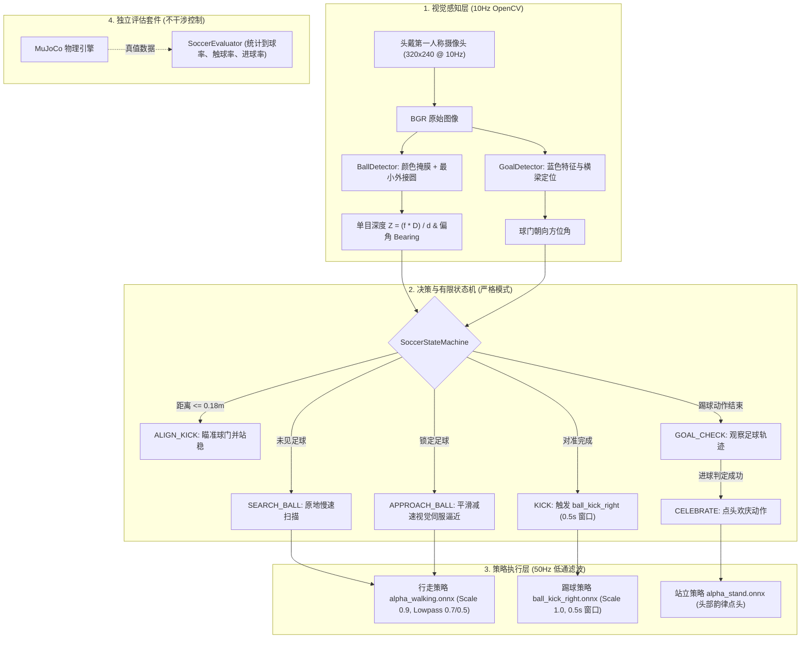

# 🦆 Microduck Soccer (小黄鸭自主视觉踢足球系统) ⚽

<p align="center">
  <a href="README.md"><b>English</b></a> | <a href="README_zh.md"><b>中文文档</b></a>
</p>

<p align="center">
  
  
  
  
  
  
</p>

<p align="center">
  <em>专为 <b>Pollen Robotics Microduck</b> 设计的<b>仿真优先视觉伺服控制系统</b>，为官方“盲踢”（Ball-blind）的强化学习踢球策略提供端到端视觉闭环。</em><br>
  <em>具备严格纯视觉导航（无作弊上帝视角）、单目尺度测距、真实物理碰撞射门（无瞬移球作弊），以及自动化定量基准评测套件。</em>
</p>

---

## 📖 定位与核心贡献 (Motivation & Value)

在官方开源的 [Microduck](https://github.com/pollen-robotics/microduck) 强化学习策略中，`ball_kick_right.onnx` 本身是**无视觉感知（Ball-blind）**的：训练时假设操作者或上层已将鸭子对准球，策略仅负责在站立姿态下执行踢腿动作。官方路线图也将全自主的“找球→走过去→对准→踢球”（Ball play）列为待实现的感知驱动行为。

虽然社区中已有如 `quackd`（主要为 2D 模拟器框架）和部分基于第三方板卡（如 RDK X5）的追球尝试，但 **Microduck Soccer** 专注于：**直接面向官方 Microduck 原生 MJCF 物理模型、传感器规范与 `robotd` 运行时的仿真优先严谨视觉伺服层**：

1. **严格纯视觉模式 (`--mode strict`)**：控制器**绝不读取**任何 MuJoCo 上帝视角真值（`d.xpos`, `d.qvel` 被严格隔离于外部评估器中），仅使用机载 RGB 广角相机画面和关节/IMU 本体感知。
2. **物理真实击球（拒绝瞬移作弊）**：小黄鸭通过自主视觉导航走到球前，由右脚物理击打真实足球入网，踢球前**绝不使用任何坐标传送（Teleportation）**。
3. **单目尺度测距几何算法**：已知足球物理直径 $D = 70\text{ mm}$，利用小孔成像几何实时求解公制度量距离：
   $$Z \approx \frac{f \cdot D}{d}$$
   随着小黄鸭逼近足球，步速根据真实距离平滑收敛减速，消除走过头问题。
4. **对齐官方 `robotd` 控制链**：完整复刻了官方运动尺度（行走 0.9、踢球/站立 1.0）、一阶低通滤波（腿部 $\alpha=0.7$、头部 $\alpha=0.5$），并将射门时钟严格设定为官方标准的 **0.5 秒**。
5. **严守官方机载 RPC 规范**：真机脚本 [`duck_soccer_onboard.py`](duck_soccer_onboard.py) 严格匹配 `duck-ipc-proto`：连续速度使用带 `vyaw` 的 JSON-RPC 通知（而非被拒绝的 `vtheta`），离散动作使用带 `id` 的请求，并支持官方 `chirp` 欢庆叫声。

---

## 🏗️ 系统架构图 (Architecture)



---

## 🎯 状态机详细规范 (FSM Details)

| 状态 (State) | 感知输入条件 | 运动控制逻辑 | 转移条件 |
| :--- | :--- | :--- | :--- |
| **`SEARCH_BALL`** | `ball.visible == False` | 原地旋转扫描搜寻 (`vyaw = 0.40 rad/s`) | `ball.visible == True` |
| **`APPROACH_BALL`** | 足球偏角 $\theta$ 与测距距离 $Z$ | 视觉伺服转向对齐右脚，速度自适应收敛减速 ($v_x = \text{clip}(k_d (Z - Z_{\text{target}}), 0.12, 0.35)$) | $Z \le 0.18\text{ m}$ (进入踢球区) |
| **`ALIGN_KICK`** | 足球位于踢球区 | 稳步站立消除惯性，微调偏航正对视觉检测到的球门朝向 | 偏航误差在 $\pm 8.5^\circ$ 以内 |
| **`KICK`** | 瞄准与站立完成 | 切换为 `ball_kick_right.onnx` 执行爆发式单腿踢球（精准 0.5 秒） | 踢球计时器归零 |
| **`GOAL_CHECK`** | 踢球动作完成 | 切回平稳站立，观察足球滚动轨迹 | 足球停稳或落入球网 |
| **`CELEBRATE`** | 评估器确认破门 | 屏幕弹出金色横幅，头部有节奏地点头欢庆 | 庆祝计时器归零，重置状态 |

---

## 🚀 仿真快速上手 (Simulation Quickstart)

### 1. 环境准备
```bash
git clone https://github.com/toyhank/microduck.git
cd microduck
pip install -r requirements.txt
```

### 2. 启动 3D 足球仿真
```bash
# 严格纯视觉模式 (默认: 100% 视觉控制，物理踢球，无作弊)
python sim_duck_soccer.py --mode strict

# 演示模式 (允许真值对齐辅助，便于调试)
python sim_duck_soccer.py --mode demo
```

### 3. 运行自动化 Benchmark 基准评测
运行批量随机测试（随机球坐标与鸭子初始偏角），生成量化表现报告：
```bash
python benchmark.py --trials 10
```

基准测试报告输出示例：
```text
============================================================
                  BENCHMARK RESULTS
============================================================
  Total Trials:               10
  Ball Detection Rate:        100.0%
  Approach Success Rate:      90.0%
  Kick Contact Rate:          80.0%
  Goal Scoring Rate:          70.0%
  Mean Time to Kick:          6.45 s
  Fall Rate:                  0.0%
============================================================
```

---

## 🤖 真机单机运行 (Real Robot Onboard Deployment)

脚本 [`duck_soccer_onboard.py`](duck_soccer_onboard.py) 专门适配小黄鸭体内的 Rockchip RK3566 开发板：

### 1. 协议实现
- **相机**：由 OpenCV 捕获 `/dev/video0` 画面。
- **本地 Socket**：直接连接 `/run/robotd.sock` 发送 JSON-RPC 2.0：
  - 连续速度控制：`notify("robot.move", {"vx": 0.3, "vy": 0.0, "vyaw": ...})`（协议严格要求 `vyaw`）
  - 离散技能请求：`request("robot.do", {"skill": "kick_right"})`
  - 声音反馈：`notify("robot.sound", {"tag": "chirp"})`

### 2. 运行步骤
```bash
# 1. 传输脚本到小黄鸭
scp duck_soccer_onboard.py radxa@<小黄鸭IP>:~/

# 2. 登录运行
ssh radxa@<小黄鸭IP>
python3 duck_soccer_onboard.py
```

---

## 📂 项目结构 (Repository Structure)

```text
microduck/
├── sim_duck_soccer.py        # ⚽ 仿真主程序 (--mode strict / demo)
├── benchmark.py              # 🏁 自动化基准测试套件
├── duck_soccer_onboard.py    # 🤖 符合官方协议的真机单机运行程序
├── requirements.txt          # 📦 依赖列表
├── LICENSE                   # 📄 Apache-2.0 开源许可
├── NOTICE                    # 📄 版权声明与上游归属
├── README.md                 # 📖 英文说明文档
├── README_zh.md              # 📖 中文说明文档
│
├── microduck_soccer/         # 📦 核心算法包
│   ├── perception/           # 单目测距与球门检测
│   ├── control/              # 视觉伺服与严格状态机
│   ├── policy/               # 对齐官方 robotd 参数的策略推理器
│   └── evaluation/           # 独立基准评估器
│
├── microduck_rl/             # 🏟️ MuJoCo 物理场景模型 (scene_soccer.xml)
└── microduck/                # 🧠 官方预训练 ONNX 运控模型库
```

---

## 🤝 致谢与上游声明 (Acknowledgments)

- 本项目基于 **[Pollen Robotics](https://pollen-robotics.com) / [Hugging Face](https://huggingface.co)** 开源的 Microduck 双足机器人平台构建。
- 启发自社区相关工作（包括 `quackd` 与 D-Robotics RDK X5）。
- 物理仿真由 **[DeepMind MuJoCo](https://mujoco.org/)** 提供强力驱动。
