# 🦆 Microduck Vision Soccer (小黄鸭自主视觉踢足球系统) ⚽

<p align="center">
  <a href="README.md"><b>English</b></a> | <a href="README_zh.md"><b>中文文档</b></a>
</p>

<p align="center">
  
  
  
  
  
  
</p>

<p align="center">
  <em>专为 <b>Pollen Robotics Microduck</b> 设计的<b>仿真优先视觉伺服控制系统</b>，为官方“盲踢”（Ball-blind）的强化学习踢球策略提供视觉接近与定时终末控制。</em><br>
  <em>具备严格纯视觉导航（无作弊上帝视角）、单目尺度测距、真实物理碰撞射门（无瞬移球作弊），以及自动化定量基准评测套件。</em>
</p>

> **当前状态：仿真实验原型。** 已接入距离减速、真实踢腿接触统计和共享真机状态机。严格视觉模式近距离仍采用经过校准的定时盲走；球门朝向目前只作观测，不参与瞄准。另新增下方的仿真真值导航基线。真机尚未验证。测试方法与限制见 [VALIDATION.md](VALIDATION.md)。


---

## 📖 定位与核心贡献 (Motivation & Value)

在官方开源的 [Microduck](https://github.com/pollen-robotics/microduck) 强化学习策略中，`ball_kick_right.onnx` 本身是**无视觉感知（Ball-blind）**的：训练时假设操作者或上层已将鸭子对准球，策略仅负责在站立姿态下执行踢腿动作。官方路线图也将全自主的“找球→走过去→对准→踢球”（Ball play）列为待实现的感知驱动行为。

虽然社区中已有如 `quackd`（主要为 2D 模拟器框架）和部分基于第三方板卡（如 RDK X5）的追球尝试，但 **Microduck Soccer** 专注于：**直接面向官方 Microduck 原生 MJCF 物理模型、传感器规范与 `robotd` 运行时的仿真优先严谨视觉伺服层**：

1. **严格纯视觉模式 (`--mode strict`)**：控制器**绝不读取**任何 MuJoCo 上帝视角真值（球的世界坐标与速度仅供外部评估；关节速度和 IMU 仍供底层策略使用），仅使用机载 RGB 广角相机画面和关节/IMU 本体感知。
2. **物理真实击球（拒绝瞬移作弊）**：小黄鸭通过自主视觉导航走到球前，尝试由右脚物理击打足球，踢球前**绝不使用任何坐标传送（Teleportation）**。
3. **单目尺度测距几何算法**：已知足球物理直径 $D = 70\text{ mm}$，利用小孔成像几何实时求解公制度量距离：
   $$Z \approx \frac{f \cdot D}{d}$$
   随着小黄鸭逼近足球，步速根据真实距离平滑收敛减速，降低接近阶段的速度；盲区内仍可能出现位置误差。
4. **对齐官方 `robotd` 控制链**：完整复刻了官方运动尺度（行走 0.9、踢球/站立 1.0）、一阶低通滤波（腿部 $\alpha=0.7$、头部 $\alpha=0.5$），并将射门时钟严格设定为官方标准的 **0.5 秒**。
5. **严守官方机载 RPC 规范**：真机脚本 [`duck_soccer_onboard.py`](duck_soccer_onboard.py) 按 `duck-ipc-proto` 编写（尚未真机验证）：连续速度使用带 `vyaw` 的 JSON-RPC 通知（而非被拒绝的 `vtheta`），离散动作使用带 `id` 的请求，并支持官方 `chirp` 欢庆叫声。

---

## 🏗️ 系统架构图 (Architecture)

```mermaid
flowchart TD
    subgraph SENSE ["1. 视觉感知层 (10Hz OpenCV)"]
        Cam["头戴第一人称摄像头 (320x240 @ 10Hz)"] --> BGR["BGR 原始图像"]
        BGR --> BallDet["BallDetector: 颜色掩膜 + 最小外接圆"]
        BGR --> GoalDet["GoalDetector: 蓝色特征与横梁定位"]
        BallDet --> Depth["单目深度 Z = (f * D) / d & 偏角 Bearing"]
        GoalDet --> GoalBearing["球门朝向方位角"]
    end

    subgraph BRAIN ["2. 决策与有限状态机 (严格模式)"]
        Depth --> FSM{"SoccerStateMachine"}
        FSM -->|未见足球| S1["SEARCH_BALL: 原地慢速扫描"]
        FSM -->|锁定足球| S2["APPROACH_BALL: 全向视觉伺服与漂移补偿逼近"]
        FSM -->|cy >= 230 且方向误差合格| S3["TERMINAL_APPROACH: 定时盲进与侧移"]
        FSM -->|盲进步完成| S4["ALIGN_KICK: 站立姿态消除惯性"]
        FSM -->|站立稳固| S5["KICK: 触发 ball_kick_right 爆发踢球 (0.5s 窗口)"]
        FSM -->|踢球动作结束| S6["GOAL_CHECK: 观察足球轨迹与补射判定"]
        S6 -->|进球判定成功| S7["CELEBRATE: 点头欢庆动作"]
    end

    subgraph ACT ["3. 策略执行层 (50Hz 低通滤波)"]
        S1 & S2 & S3 --> WalkPol["行走策略 alpha_walking.onnx (Scale 0.9, Lowpass 0.7/0.5)"]
        S4 & S6 & S7 --> StandPol["站立策略 alpha_stand.onnx (Scale 1.0)"]
        S5 --> KickPol["踢球策略 ball_kick_right.onnx (Scale 1.0, 0.5s 窗口)"]
    end

    subgraph EVAL ["4. 独立评估套件 (不干涉控制)"]
        MuJoCo["MuJoCo 物理引擎"] -. 真值数据 .-> Eval["SoccerEvaluator (统计触球判定、冲量传递、进球率)"]
    end
```



---

## 🎯 状态机详细规范 (FSM Details)

由于机载前向相机在近距离时存在“鸭嘴盲区”（距机体 $Z \le 0.35\text{ m}$ 的足球会滑出视野下方），本方案采用视觉接近加定时开环终末动作；盲区边界和位移依赖相机姿态与实际步态：

| 状态 (State) | 感知输入条件 | 运动控制逻辑 | 转移条件 |
| :--- | :--- | :--- | :--- |
| **`SEARCH_BALL`** | `ball.visible == False` | 原地旋转扫描搜寻 (`vyaw = 0.40 rad/s`) | `ball.visible == True` |
| **`APPROACH_BALL`** | 足球偏角 $\theta$ 与测距距离 $Z$ | 全向视觉伺服对齐右脚方向，前向匀速逼近并进行侧向漂移补偿 ($v_x = 0.30\ldots0.35$，偏差大时先转向) | 足球触及相机视野底部 ($c_y \ge 230$) |
| **`TERMINAL_APPROACH`** | 足球进入鸭嘴视线盲区 | 执行定时盲步（$v_x=0.35$, $v_y=0.06$, $t=1.52$）；指令速度不等于实际位移，需校准 | 盲步计时器到期 ($t \ge 1.52\text{ s}$) |
| **`ALIGN_KICK`** | 终末计时结束（未确认球的位置） | 切入 `alpha_stand` 稳固站立消除身体前倾惯性 | 站立平稳计时器到期 ($t \ge 0.30\text{ s}$) |
| **`KICK`** | 站立计时结束 | 切换为 `ball_kick_right.onnx` 执行爆发式单腿踢球（精准 0.5 秒） | 踢球动作窗口结束 |
| **`GOAL_CHECK`** | 踢球动作完成 | 切回站立姿态，观察足球滚动轨迹 | strict 模式等待后重新搜球；进球真值只用于统计 |
| **`CELEBRATE`** | 仅 demo 模式允许评估器触发 | 屏幕弹出金色横幅，头部有节奏地点头欢庆 | 庆祝计时器归零，重置状态 |

---

## 🚀 仿真快速上手 (Simulation Quickstart)

### 1. 环境准备
```bash
git clone https://github.com/toyhank/microduck-vision-soccer.git
cd microduck-vision-soccer
pip install -r requirements.txt
```

### 2. 启动 3D 足球仿真
```bash
# 严格纯视觉模式 (默认: 100% 视觉控制，物理踢球，无作弊)
python sim_duck_soccer.py --mode strict

# 1对1对战模式：自主纯视觉守门鸭 (身穿翡翠绿球衣，机载 10Hz 单目视觉 + 弹道预测拦截，开启双屏 HUD)
python sim_duck_soccer.py --mode strict --goalkeeper

# 录制 1v1 高清双视角对战视频至 MP4 (1280x480)
python sim_duck_soccer.py --mode strict --goalkeeper --record match.mp4 --duration 12

# 守门员真值对照模式 (Oracle 基线)
python sim_duck_soccer.py --mode strict --goalkeeper --gk-mode oracle

# 可选参数：无头高速运行、限制仿真秒数
python sim_duck_soccer.py --headless --duration 12

# 演示模式 (允许真值对齐辅助，便于调试)
python sim_duck_soccer.py --mode demo
```

### 3. 运行自动化 Benchmark 基准评测
运行批量随机测试（随机球坐标与鸭子初始偏角），生成量化表现报告：
```bash
python benchmark.py --trials 10
```

使用固定种子保存每次试验结果：
```bash
python benchmark.py --trials 10 --seed 0 --output results.json
python -m unittest discover -s tests -v
```
`kick_contact` 只统计踢腿策略期间真实的右脚—球接触；走路碰球单列为 `foot_contact`。距离接近和球速变化不再算作触球。进入终末接近状态不代表成功到达击球位置。


---

## 仿真真值导航基线（Oracle）

`oracle_soccer.py` 读取仿真中的机器人/球位置、球速和脚球间隙，先走到球后方，站稳后补偿出球偏角，再调用现有右脚踢球策略。机器人和球只在开局初始化一次，之后依靠关节控制和 MuJoCo 碰撞运动。此模式不使用相机，不能直接部署到真机。

```bash
# 打开仿真窗口，观察完整接近和射门过程
python oracle_soccer.py --viewer --seed 100
# 无需渲染器的批量测试
python oracle_soccer.py --seed 100 --trials 100 --duration 40 --workers 4 --output oracle-results.json
```

冻结控制参数后，独立种子 100–199 实测：**进球 98/100，有踢腿触球且进球 96/100，跌倒 0/100**。其中 2 次为走路推球进门，没有踢腿触球。这只覆盖指定的初始位置范围，不代表严格视觉模式的成功率。测试条件和失败样本见 [ORACLE_VALIDATION.md](ORACLE_VALIDATION.md)，逐次结果见 [JSON](validation/oracle-seeds-100-199.json)。

## 🤖 真机单机运行 (Real Robot Onboard Deployment)

脚本 [`duck_soccer_onboard.py`](duck_soccer_onboard.py) 专门适配小黄鸭体内的 Rockchip RK3566 开发板：

### 1. 协议实现
- **相机**：由 OpenCV 捕获 `/dev/video0` 画面。
- **本地 Socket**：直接连接 `/run/robotd.sock` 发送 JSON-RPC 2.0：
  - 连续速度控制：`notify("robot.move", {"vx": 0.3, "vy": 0.0, "vyaw": ...})`（协议严格要求 `vyaw`）
  - 离散技能请求：`request("robot.do", {"skill": "kick_right"})`
  - 声音反馈：`notify("robot.sound", {"tag": "chirp"})`

### 2. 运行步骤
```bash
# 1. 传输脚本到小黄鸭
scp -r duck_soccer_onboard.py microduck_soccer radxa@<小黄鸭IP>:~/

# 2. 登录运行
ssh radxa@<小黄鸭IP>
python3 duck_soccer_onboard.py
```

---

## 📂 项目结构 (Repository Structure)

```text
microduck-vision-soccer/
├── sim_duck_soccer.py        # ⚽ 仿真主程序 (--mode strict / demo)
├── benchmark.py              # 🏁 自动化基准测试套件
├── duck_soccer_onboard.py    # 🤖 符合官方协议的真机单机运行程序
├── oracle_soccer.py          # 🎯 仿真真值导航对比基线
├── requirements.txt          # 📦 Python 依赖列表
├── LICENSE                   # 📄 Apache-2.0 开源许可
├── NOTICE                    # 📄 版权声明与上游归属
├── README.md                 # 📖 英文说明文档
├── README_zh.md              # 📖 中文说明文档
│
├── assets/                   # 🏟️ 彻底解耦的仿真与策略资产库
│   ├── scene_soccer.xml      # MuJoCo 足球场仿真场景定义 (单鸭模式)
│   ├── scene_soccer_goalkeeper.xml # 双鸭对战场景 (进攻鸭 + 守门鸭)
│   ├── robot_allcollisions.xml # 进攻鸭机器人本体结构与碰撞体
│   ├── robot_goalkeeper.xml  # 守门鸭机器人定义 (翡翠绿战袍涂装)
│   ├── meshes/               # 94 个 STL/part 3D 几何网格
│   └── policies/             # 独立的 ONNX 运控模型（行走、踢球、站立）
│
├── microduck_soccer/         # 📦 核心算法包
│   ├── assets.py             # 资产路径自动解析与管理
│   ├── perception/           # 单目测距与球门检测
│   ├── control/              # 视觉伺服、严格状态机与守门员控制器
│   ├── policy/               # 对齐官方 robotd 参数的策略推理器
│   └── evaluation/           # 独立基准评估器 (进球与扑救统计)
│
├── tests/                    # 🧪 单元回归测试集
└── validation/               # 📊 验证基准测试报告与数据
```

---

## 🤝 致谢与上游声明 (Acknowledgments)

- 本项目基于 **[Pollen Robotics](https://pollen-robotics.com) / [Hugging Face](https://huggingface.co)** 开源的 Microduck 双足机器人平台构建。
- 启发自社区相关工作（包括 `quackd` 与 D-Robotics RDK X5）。
- 物理仿真由 **[DeepMind MuJoCo](https://mujoco.org/)** 提供强力驱动。
